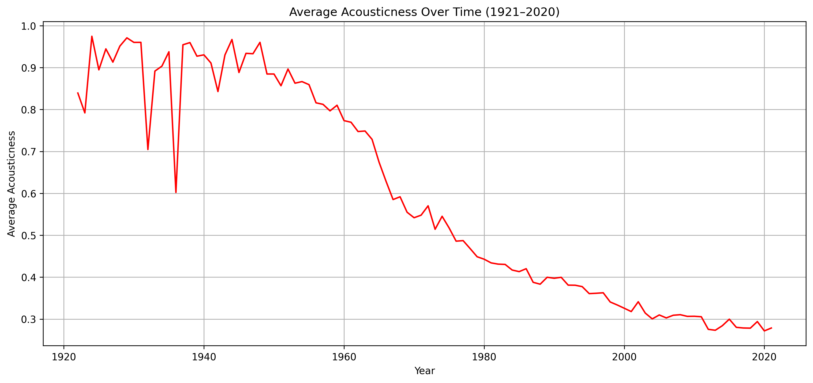
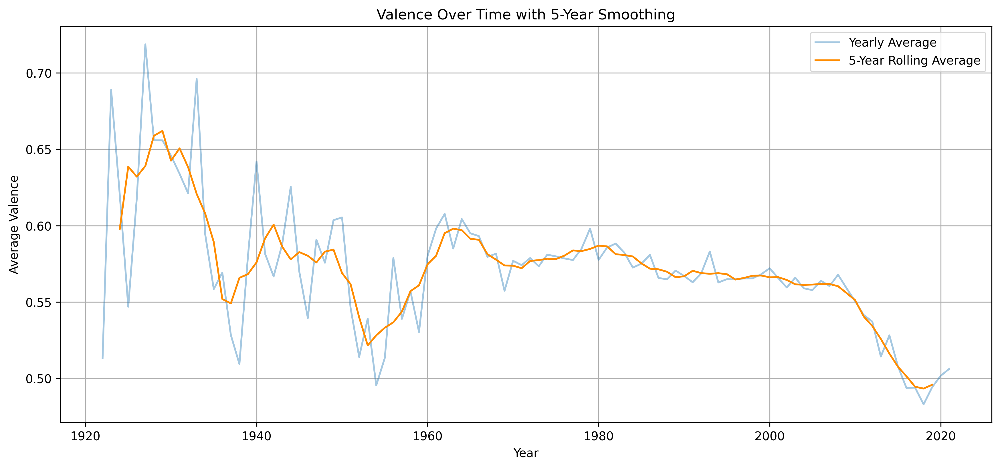
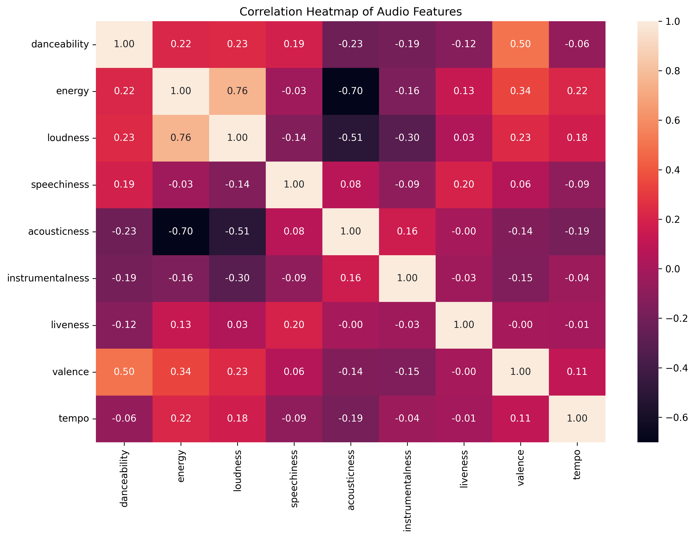
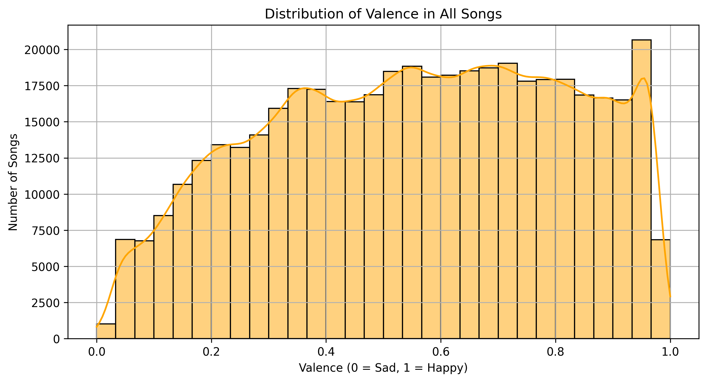

<!-- # 🎵 Emotions in Music: A Century of Spotify Trends (1921–2020)
## Project Overview
This project explores how the emotional tone of popular music has evolved over the past 100 years using Spotify’s valence metric. 

## Key Questions
- Are songs becoming happier or sadder?
- How do historical events influence music mood?
- Which genres/artists reflect emotional shifts?

## Dataset
- Source: [Ultimate Spotify Tracks DB (Kaggle)](https://www.kaggle.com/datasets/zaheenhamidani/ultimate-spotify-tracks-db)

## Highlights
- Trendline of average valence per year
- Emotion shifts during wars, crises, pandemics
- Top "happiest" and "saddest" songs per decade

## Folder Structure
[Explain folders like `/data`, `/notebooks`, `/src`, etc.]

## Key Visualizations
[Insert 2–3 preview images using ``]

## Tech Stack
- Python, Pandas, Seaborn, Matplotlib, Plotly
- (Optional) Streamlit, Scikit-learn

## References
- Spotify Web API (valence definition)
- Timeline events sourced from history.com -->

# 🎵 Emotions in Music: A Century of Spotify Trends (1921–2020)


## Project Overview

This comprehensive data science project analyzes the emotional and acoustic evolution of popular music over the past century using Spotify's audio features. Through exploratory data analysis, we uncover fascinating trends in musical characteristics, revealing how technology, culture, and historical events have shaped the soundscape of human expression.

## Key Research Questions

- **Emotional Evolution**: Are songs becoming happier or sadder over time?
- **Technological Impact**: How has the shift from acoustic to electronic music transformed our musical landscape?
- **Cultural Correlation**: Do historical events (wars, economic crises, pandemics) influence musical mood and characteristics?
- **Audio Feature Relationships**: What patterns exist between danceability, energy, valence, and other musical properties?
- **Temporal Patterns**: How do different audio features correlate and evolve across decades?

## Major Discoveries

### **The Death of Acoustic Music**
- **Dramatic 70% decline** in acousticness from 1921 to 2020
- Near-complete transition from acoustic (0.9+) to electronic (0.3) music production
- Acceleration of change starting in the 1960s with electric instruments

### **The Happiness Decline**
- **Steady decrease** in musical valence (happiness) over 100 years
- Peak happiness in the 1920s-1930s, lowest levels in recent decades  
- Particularly steep decline after 2000, reflecting modern cultural shifts

### **Musical Relationships**
- **Strong correlation (0.50)** between danceability and happiness
- Energy and loudness move together (0.76 correlation)
- Electronic music tends to be more energetic than acoustic music

## Dataset

- **Source**: [Spotify Datasets (Kaggle)](https://www.kaggle.com/datasets/lehaknarnauli/spotify-datasets)
- **Time Span**: 1921–2020 (nearly 100 years of music history)
- **Features Analyzed**: Valence, Acousticness, Danceability, Energy, Loudness, Speechiness, Instrumentalness, Liveness, Tempo

## Project Structure

```
spotify-valence-trends/
├── data/                    
│   └── tracks.csv
├── images/                  
│   ├── average_acousticness.png
│   ├── average_valence_per_year.png
│   ├── correlation_heatmap_of_audio_features.png
│   ├── danceability_vs_valence.png
│   ├── distribution_of_valence.png
│   ├── energy_vs_valence.png
│   ├── timeline.png
│   └── valence_over_time_with_5-year_smoothing.png
├── notebooks/
│   └── spotify_valence_trends.ipynb
├── report/
│   └── Spotify Music Data Analysis Report.pdf
├── README.md
└── requirements.txt
      
```

## Key Visualizations

### Temporal Evolution  
  
*The dramatic decline of acoustic music from 1921–2020*

### Emotional Trends  
  
*How musical happiness has changed across decades*

### Feature Relationships  
  
*Relationships between different audio features*

### Distribution Analysis  
  
*The emotional spectrum of popular music*


## Technology Stack

### Core Libraries
- **Data Processing**: `pandas`, `numpy`
- **Visualization**: `matplotlib`, `seaborn`, `plotly`
- **Statistical Analysis**: `scipy`, `scikit-learn`
- **Notebook Environment**: `jupyter`

### Additional Tools
- **Time Series Analysis**: Rolling averages and trend analysis
- **Correlation Analysis**: Pearson correlation matrices
- **Historical Context**: Event timeline integration

## Getting Started

### Prerequisites
```bash
Python 3.8+
pip or conda package manager
```

### Installation
1. **Clone the repository**
   ```bash
   git clone https://github.com/arooj-zehra/spotify-valence-trends.git
   cd spotify-valence-trends
   ```

2. **Install dependencies**
   ```bash
   pip install -r requirements.txt
   ```

3. **Launch Jupyter Notebook**
   ```bash
   jupyter notebook notebooks/
   ```

4. **Run the analysis**
   - Use`spotify valence trends.ipynb`
   - To save visualizations to the images/ folder, use:
      ```bash 
      plt.savefig("images/your_filename.png", dpi=300, bbox_inches='tight')

## Key Insights & Findings

### **Musical Evolution Timeline**
- **1920s-1940s**: Peak of acoustic music and emotional diversity
- **1950s-1960s**: Beginning of electric revolution
- **1980s-2000s**: Digital music production takes over
- **2000s-2020**: Stabilization at low acousticness, continued valence decline

### **Cultural Correlations**
- Music serves as emotional barometer of societal changes
- Historical events correlate with temporary valence fluctuations
- Long-term trends reflect technological and cultural evolution

### **Feature Relationships**
- Happier songs are consistently more danceable
- Electronic music correlates with higher energy levels
- Modern production techniques show increasing standardization

## Statistical Highlights

- **Acousticness decline**: 70% reduction over 100 years
- **Valence correlation**: 0.50 with danceability, 0.34 with energy
- **Energy-loudness**: Strongest correlation at 0.76
- **Temporal stability**: Consistent patterns across decade analyses

## Future Research Directions

- **Genre-specific analysis**: How do trends vary across musical genres?
- **Lyrical sentiment**: Incorporating text analysis with audio features
- **Predictive modeling**: Forecasting future musical trends
- **Cultural expansion**: Including global music traditions and regional patterns
- **Real-time analysis**: Monitoring contemporary trends as they develop

## References & Data Sources

- **Historical Events**: Timeline correlations sourced from history.com
- **Academic Research**: Music psychology and cultural studies references
- **Technical Documentation**: Pandas, Matplotlib, and Seaborn official guides

## 🎧 Project Soundtrack  
> *This track was on loop while working on this project.*

**[“Coco Manifesto” – Joon Gloom](https://open.spotify.com/track/6A1QXpC9KUYas8PX9Q8JEa?si=ec5527038ce642cf)**

 **Star this repository if you found it interesting!** ⭐
 
 **made with ❤️ by arooj**
